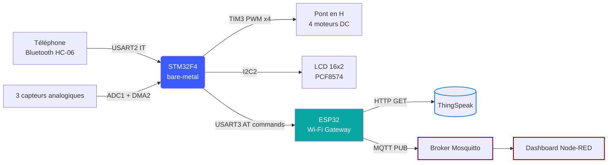
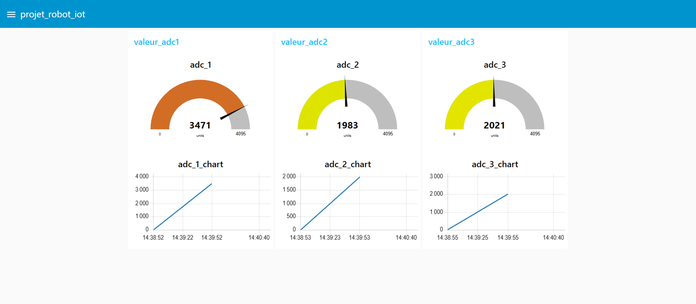
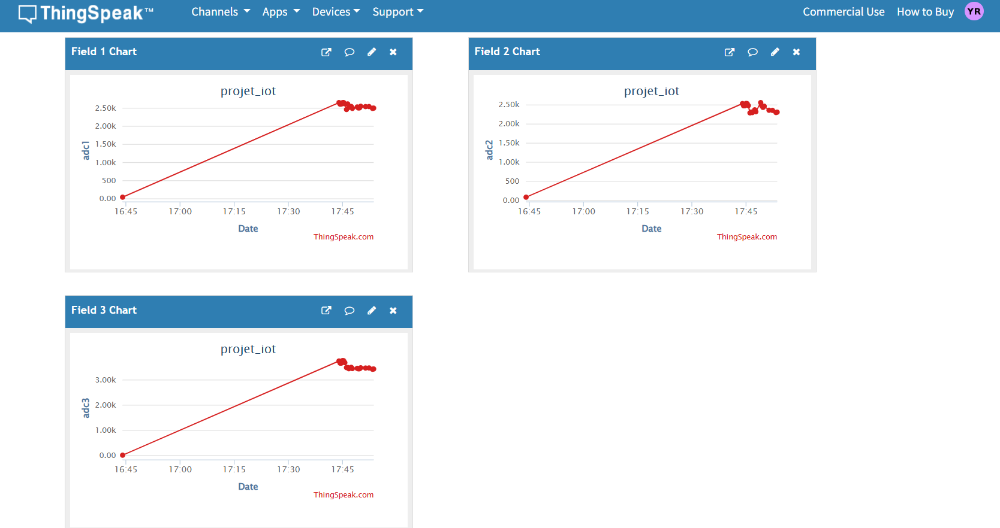
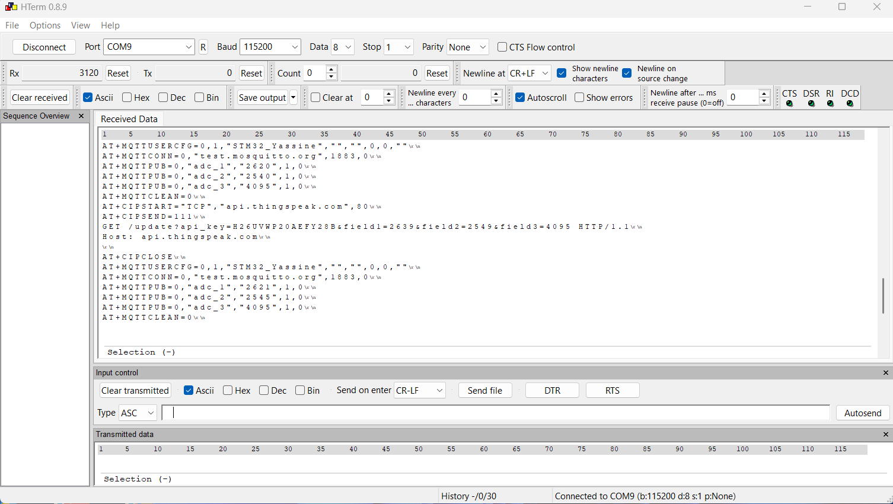
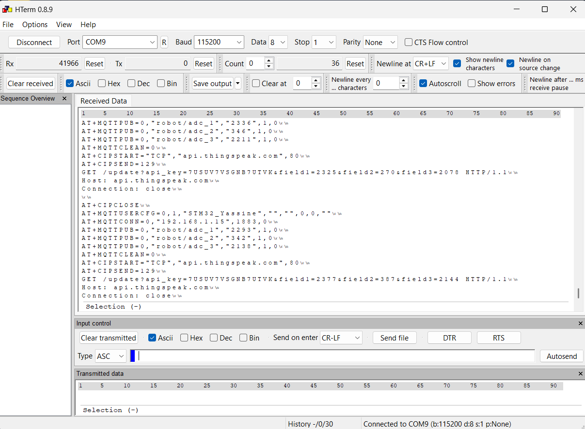

<div align="center">

# Robot Mobile IoT — Bare-Metal STM32F4 + ESP32

### Commande temps réel et supervision cloud, entièrement en accès registre direct


`Bare-Metal` · `Real-Time Control` · `IoT` · `Multi-Peripheral Firmware`

</div>

---

## 📋 Overview

Robot mobile 4 roues piloté par Bluetooth, entièrement développé **bare-metal sur STM32F4** — chaque périphérique est configuré par accès direct aux registres (aucune couche HAL, aucun code généré par CubeMX). Le firmware pilote quatre canaux PWM moteur, analyse des commandes texte reçues par liaison Bluetooth, acquiert trois capteurs analogiques en continu via ADC+DMA, affiche l'état sur un LCD I2C local, et supervise le tout à distance en alternant entre **ThingSpeak** (historique cloud) et un **broker MQTT** (Mosquitto → dashboard Node-RED), relayé par un module ESP32 en commandes AT.

## ⚙️ Key Contributions

- ⚙️ Commande des 4 canaux moteur DC via PWM (TIM3), pilotage différentiel pour les virages
- 📡 Parsing de commandes Bluetooth (HC-06) par interruption + détection de fin de trame (ligne IDLE)
- 📊 Acquisition ADC multi-canaux (3 voies) déclenchée par timer, transférée en DMA circulaire
- 🖥️ Affichage local en temps réel sur LCD I2C 16x2 (protocole bas-niveau, sans librairie)
- ☁️ Communication ESP32 via commandes AT, avec bascule automatique ThingSpeak / MQTT toutes les 30s
- 🔒 Gestion de priorités NVIC explicites : les commandes robot priment sur l'acquisition et l'IoT

## 🏗️ Architecture



## 🎥 Voir le système en action

### Dashboard Node-RED — jauges temps réel

<div align="center">
  
  <br><em>Visualisation temps réel des trois canaux capteurs via Node-RED</em>
</div>

### ThingSpeak — historique cloud

<div align="center">
  
  <br><em>Historique cloud des valeurs adc1/adc2/adc3 sur ThingSpeak</em>
</div>

### Trace série (HTerm) — bascule ThingSpeak / MQTT

<div align="center">
  
  <br><em>Un cycle complet : publication MQTT (adc_1/2/3) puis requête HTTP GET vers ThingSpeak</em>
</div>

<div align="center">
  
  <br><em>Publication MQTT sur les topics robot/adc_1, robot/adc_2, robot/adc_3</em>
</div>

## 🔧 Hardware & brochage

| Périphérique | Broches | Rôle |
|---|---|---|
| TIM3 PWM (CH1–CH4) | PA6, PA7, PB0, PB1 | 4 canaux PWM moteur (~1 kHz) |
| USART2 + DMA1_S6 | PA2 / PA3 | Bluetooth HC-06 (9600 bauds), TX non bloquant via DMA |
| USART3 | PC10 / PC11 | Liaison ESP32 (115200 bauds) |
| ADC1 + DMA2_S0 | PC0 / PC1 / PC2 | 3 capteurs, mode scan + DMA circulaire |
| TIM2 | — | Déclenche les conversions ADC (TRGO) |
| TIM4 | — | Tick 1 Hz → cycle IoT toutes les 30s |
| EXTI0 | PA0 | Bouton utilisateur — démarre l'acquisition |
| I2C2 | PB10 / PB11 | LCD 16x2 (PCF8574, adresse 0x27) |

Les priorités NVIC sont fixées explicitement pour que la réception des commandes Bluetooth (USART2) préempte toujours les tâches de fond plus lentes.

## 💻 Code — Configuration PWM moteur (bare-metal, TIM3)

```c
void init_tim3_pwm(void)
{
    RCC->APB1ENR |= (1 << 1);
    TIM3->PSC     = 15;              // 16 MHz / 16 = 1 MHz horloge timer
    TIM3->ARR     = 999;             // → PWM à 1 kHz
    TIM3->CCMR1  |= (6 << 4) | (6 << 12); // Mode PWM 1 sur CH1/CH2
    TIM3->CCMR2  |= (6 << 4) | (6 << 12); // Mode PWM 1 sur CH3/CH4
    TIM3->CCER   |= (1 << 0) | (1 << 4) | (1 << 8) | (1 << 12);
    TIM3->CR1    |= (1 << 0); // Démarrer TIM3
}
```

## 💻 Code — Interprétation des commandes robot (Bluetooth)

```c
void cmd_ROBOT(void)
{
    if (strstr(cmd_buf, "AVANCE"))
    {
        CCR1 = vitesse; CCR2 = 0;   // Moteur droit avant
        CCR3 = vitesse; CCR4 = 0;   // Moteur gauche avant
    }
    else if (strstr(cmd_buf, "GAUCHE"))
    {
        CCR1 = vitesse;     CCR2 = 0; // Droit à pleine vitesse
        CCR3 = vitesse / 2; CCR4 = 0; // Gauche ralenti → virage
    }
    else if (strstr(cmd_buf, "STOP"))
    {
        vitesse = 200;
        CCR1 = CCR2 = CCR3 = CCR4 = 0;
    }
    TIM3->CCR1 = CCR1; TIM3->CCR2 = CCR2;
    TIM3->CCR3 = CCR3; TIM3->CCR4 = CCR4;

    // Confirmation renvoyée au téléphone
    sprintf(tx_buf, "CMD:%s|V=%u\r\n", cmd_buf, vitesse);
    uart2_envoie_dma(tx_buf, strlen(tx_buf));
}
```

## 💻 Code — Bascule automatique ThingSpeak / MQTT

```c
if (flag_iot_envoie)
{
    flag_iot_envoie = 0;
    if (iot_tour == 0)
    {
        iot_thingspeak();   // Envoi HTTP GET vers ThingSpeak
        iot_tour = 1;
    }
    else
    {
        iot_mqtt();         // Publication MQTT (robot/adc_1, adc_2, adc_3)
        iot_tour = 0;
    }
}
```

Chaque valeur ADC est publiée toutes les 30 secondes, en alternant les deux canaux de supervision — ce qui garantit à la fois un historique consultable (ThingSpeak) et une visualisation temps réel (Node-RED via MQTT), sans surcharger la liaison série avec l'ESP32.

## 🚀 Build & Flash

1. Créer un projet STM32F4 vierge dans Keil µVision ou STM32CubeIDE
2. Remplacer le `main.c` généré par celui de ce repo
3. Renseigner tes identifiants Wi-Fi, ta clé ThingSpeak et l'IP de ton broker MQTT dans les `#define` en haut du fichier
4. Compiler et flasher via ST-LINK
5. Appairer le module HC-06 en Bluetooth, envoyer `AVANCE`, `GAUCHE`, `DROITE`, `ARRIERE`, `STOP`

## 🛠 Tech Stack

`STM32F4` `Bare-metal C (CMSIS)` `PWM` `UART + DMA` `ADC + DMA` `I2C` `EXTI` `Bluetooth HC-06` `ESP32` `MQTT (Mosquitto)` `ThingSpeak` `Node-RED`

## 📄 License

MIT
